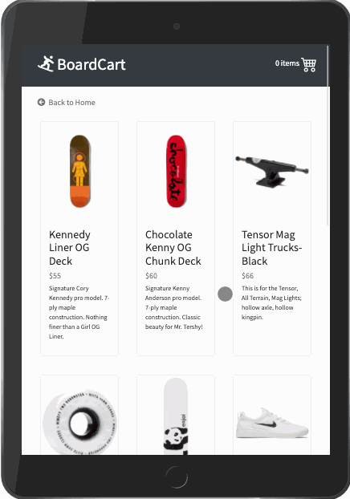

# boardcart
A full stack Node.js and React.js e-commerce shopping cart app for a board shop.

## Live Site
Try the live site here: https://boardcart.brandonktran.com/

#### Desktop
 

#### iPad
 

#### iPhone 6/7/8
 

## Technologies Used
Bootstrap<br/>
Webpack<br/> 
Babel<br/>
Node.js<br/>
Express.js<br/>
React.js <br>
PostgresQL

## Main Features
User can view products. <br/>
User can view the detail of a product. <br/>
User can add products to a cart. <br/>
User can view the products in a cart. <br/>
User can place an order for a cart. <br/>

<br/>
Front-end functionality and interface built with React.js & back-end API built using Express.js, Node.js, and PostgresQL to handle client requests and data. 


## Development
### System Requirements
Node.js 10 or higher <br>
NPM 6 or higher <br>
PostgreSQL 10 or higher <br>
Express.js 4 or higher

### Getting Started
Clone the repository.
```console
git clone https://github.com/brandonktran/boardcart.git
cd boardcart
```

Install all dependencies with NPM.
```console
npm install
```

Start the project.
```console
npm run dev
```
Then view the application by going to http://localhost:3000 in your browser.
